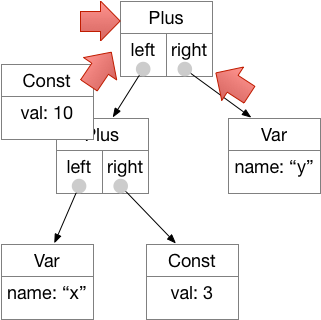
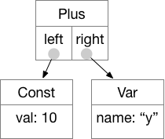

# Symbolic calculator

Usage:  ```python3 calc.py```

Example use: 

```
symcalc > python3 calc.py 
expression/'help'/'quit': x 7 =
let x = 7 -> 7
expression/'help'/'quit': y x 3 + =
let y = (x + 3) -> 10
expression/'help'/'quit': x y + z +
((x + y) + z) -> (17 + z)
expression/'help'/'quit': 
```

There are many desk calculator applications, some with fancy graphical interfaces.  This one doesn't have a fancy graphical interface, but it does have one special feature:  It's symbolic.  That means you can evaluate an expression that contains variables.  A variable is *bound* if you have assigned it a value, like this: 

```
Expression or 'quit': x 7 =
```

Otherwise it is *unbound*.  When an expression is evaluated, unbound variables are left unchanged, but values are substituted for bound variables.  Thus: 

```
let y = (x + 3) -> 10
expression/'help'/'quit': x y + z +
((x + y) + z) -> (17 + z)
```

## How it works

Module ```expr``` defines a tree data data structure for expressions.  Nodes in the tree may be constants (like 7 or 7.0), variables (like *x*), the unary negation operation (represented as *~*), or binary operations like addition, subtraction, multiplication, and division.  Constants and variables are *leaves* of the expression tree.  Unary and binary operations are *internal nodes* with two children, their left and right operands.  Each node in the tree is represented by an object that has an *eval* method.   Evaluation of interior nodes proceeds recursively:  Evaluate the operands, and then apply the operation.  If the operands are numbers, then the operation produces a number (a Const node).  If the operands are symbolic expressions, then the operation produces a symbolic expression.  Consider 

```
expression/'help'/'quit': x 7 =
let x = 7 -> 7
expression/'help'/'quit': y x 3 + =
let y = (x + 3) -> 10
```

Let's consider the steps in evaluation 
of ```((x + 3) + y)```.
Internally it is represented as an expression 
object ```Plus(Plus(Var('x'),Const(3)),Var('y'))```
which may be easier to understand if we draw it as a tree: 


We begin at the root of the tree. Before we can evaluate that node, we must evaluate its left and right operands, and before we can evaluate its left operand, we must evaluate *its* left operand ... thus we work our way recursively down to the Var node at the leftmost leaf: 


We have bound variable *x* to the constant value 7 with the assignment ```let x = 7```, so the eval() method applied to Var("x") returns the value Const(7): 


The Const(3).eval() returns Const(3), so now the Plus node can be evaluated.  Seeing that both of its operands have evaluated to constants, it can add them and produce Const(10). 


The Plus node at the root still needs to evaluate its right operand.  Because *y* is unbound (we have not given it a value),  ```Var("y").eval() returns Var("y")```:



Now that the root node has the results of evaluating both its operands, it can return a result.  Since one of its operands is not a numeric constant, it returns the new symbolic expression ```Plus(Const(10),Var("y"))```, which can be printed as
```10 + y``` or drawn as:

 
 
## Parsing Expressions

Module *rpn_parse* parses expressions and calls constructors in *expr* to build the expression tree. 
First it calls the *lexer* to produce a stream of tokens, which are the individual symbols in the input line labeled with their category (e.g., a binary operator) and the corresponding class in *expr*.  
Once we have a stream of tokens, we can build up the *Expr* structure using a list as a *stack* of expressions.  See our Tuesday lecture for more detail on the parsing process. 


## What you must do

* You must create the *abstract base class* BinOp in expr.py.  The provided class *Assign* and the abstract base class *UnOp* should help you see what needs to be done.  Your *BinOp* class should contain the *eval* method to be inherited by each concrete subclass. 
* You must create the *concrete* subclasses Plus, Minus, Times, Div corresponding to symbols +, -, \*, / in the syntax.  Inherit the *eval* method from *BinOp* (do not override it in the concrete classes), and provide a _apply method for each concrete class.  The concrete classes will also need \_\_str\_\_ and \_\_repr\_\_ methods. For each concrete BinOp subclass you will need to add a line to the table in syntax.py.
* Complete rpn_parse.py so that it can parse binary operations like Plus and Times.  
* Turn in expr.py and rpn_parse.py


