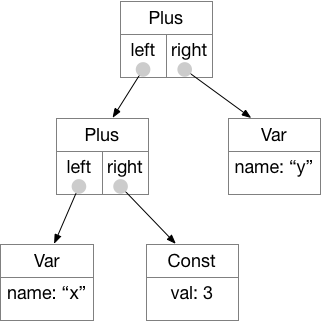
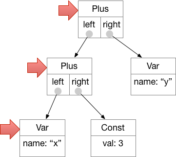
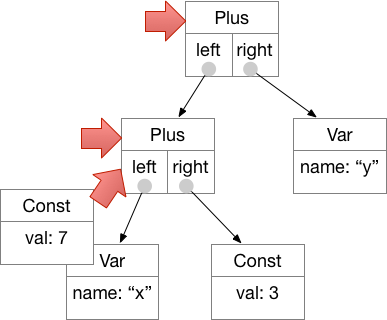
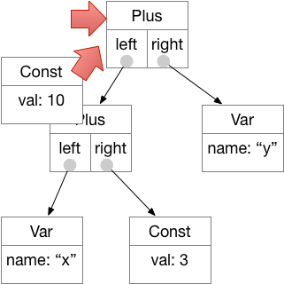
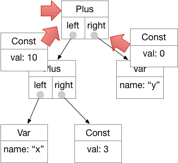
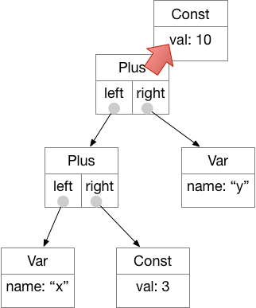

# A Calculator (or two)

In this project you will build a simple interactive calculator.  
The calculator is limited to integers (no floating-point numbers).

When you have completed the project, interaction with ```rpncalc.py``` will
look like this: 
```
Expression (return to quit):3 5 * x =
x = (3 * 5) => 15
Expression (return to quit):x 2 *
(x * 2) => 30
Expression (return to quit):
Bye! Thanks for the math!
```

Interaction with ```llcalc.py``` will look like this: 
```
xpression (return to quit): x = 3 * (5 + 2)
x = (3 * (5 + 2)) => 21
Expression (return to quit):y = 7 * 3
y = (7 * 3) => 21
Expression (return to quit):x + y
(x + y) => 42
Expression (return to quit):
Bye! Thanks for the math!
```

## Learning objectives 

The calculator project provides practice in:

* "Refactoring" redundant code from concrete subclasses 
into a shared abstract base class. 

* Using dynamic dispatch to tie together refactored code. 
Specifically, abstract base classes ```BinOp``` and ```UnOp```
will refer to methods 
and fields that exist only in the concrete subclasses
like ```Plus``` and ```Neg```. 

* Recursive traversal of object structures. ```__str__```, 
```__repr__```, and ```eval``` will make recursive calls
in a style that is a little different than recursive 
functions you have written before. 

## Instructions

Guidance for building the calculator that 
 interprets reverse Polish notation is in ```doc/HOWTO.md```.  
 
 A separate document, ```doc/LLPARSING.md```, describes how 
 ```llcalc.py``` interprets algebraic notation like 
 ```(3 + 4) * 12```.  ```doc/LLPARSING.md``` and ```llcalc.py``` 
 are provided as extra reading if you are interested.  You are 
 not responsible for reading and understanding them, but you 
 might find them interesting. 
 
## Turn in
 
 The two files you should turn in are ```expr.py``` and ```rpncalc.py```. 
    

### Overview: The expression structure

The heart of the calculator is the ```Expr``` class in ```expr.py```.
We can think of the expression structure as a tree.  Nodes in the tree
may be constants (like 7), variables (like *x*), or binary operations
like addition, subtraction, multiplication, and division.  Constants
and variables are *leaves* of the expression tree.  Binary operations
are *interior nodes* with two children, their left and right operands. 



Computer scientists and software developers customarily draw the
*root* of a tree at the top and the *leaves* at the bottom.  We are
apparently not very good at botany.   


 Each node in the tree is represented by an object that has an *eval* method.  
We begin at the root of the tree. Before we can evaluate that node, we
must evaluate its left and right operands, and before we can evaluate
its left operand, we must evaluate *its* left operand ... thus we work
our way recursively down to the Var node at the leftmost leaf:  



We have bound variable *x* to the constant value 7 with the assignment
```7 x =```, so the eval() method applied to Var("x") returns the
value IntConst(7):  



The IntConst(3).eval() returns IntConst(3), so now the Plus node can be
evaluated.  Seeing that both of its operands have evaluated to
constants, it can add them and produce IntConst(10).  



The Plus node at the root still needs to evaluate its right operand.
If *y* is unbound (we have not given it a value), we will raise 
an exception.  If we have given it a value, that value
will be "bound" to the variable name in the "environment". 
In concrete terms, the environment is a dict with variable 
names as keys and IntConst objects as values.  Assume for 
this example that the (key, value) pair ("y", IntConst(0)) 
is in the environment.  We say that variable y is "bound"
to 0.  Evaluating the expression Var("y") the produces 
IntConst(0). 



Now that the root node has the results of its operands, it returns its result: 

 
 


