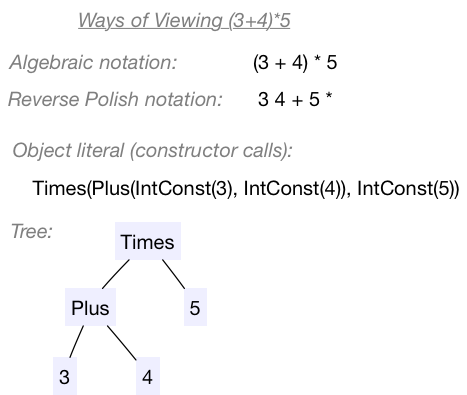
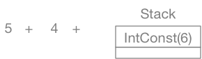
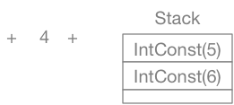
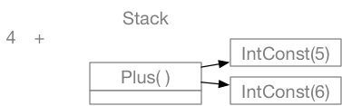
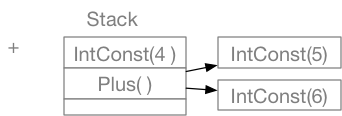
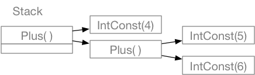
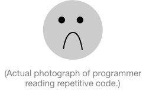
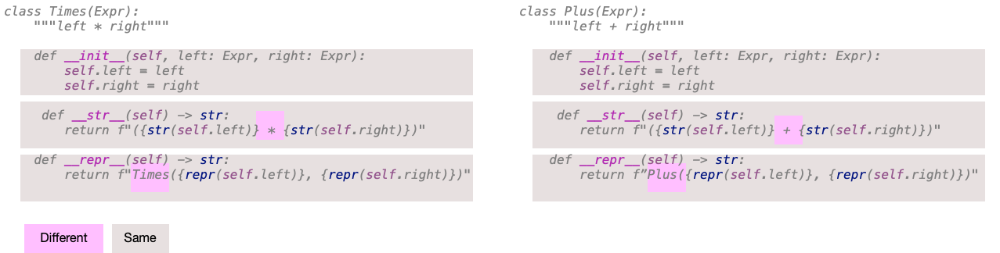

# Howto:  Calculator

In this project we're going to create a calculator.  Actually my 
plan is to create two different calculators, with some shared 
core functionality.  You will build the shared core functionality 
(a module ```expr.py``` with classes representing 
arithmetic expressions) and one of the two calculators that use it. 

One of the two calculators will take a conventional algebraic notation, 
e.g., ```( 5 + 3 ) * 4``` should produce 32. I will provide 
 that one.  The other calculator will take 
reverse Polish notation (RPN), in which we would write the same 
expression as ```5 3 + 4 *```.   Both of these calculators will
work by first translating the input into an expression tree, 
and then evaluating the expression tree.  The expression tree
is what you will build. 

## expr.py

We want to represent expressions as objects.  Some of the kinds of
expressions we want to represent include: 

* Integer constants, like 5.  The value of an integer constant
is itself.   This will be class IntConst, and we'll create it 
with a call like ```IntConst(5)```

* Variables, like x.  Our calculator will allow us to assign 
values to variables.  The value of a variable is whatever value
it is currently holding.  (More on this below.)

* Operations. There are a few kinds of these. 

    * Binary operations are like ```+``` and ```*```.  We call 
    them 'binary' because they have two operands.  For example, 
    we might create the representation of ```5 + 3``` as 
    ```Plus(IntConst(5), IntConst(3))```.  The value 
    of a binary operation is found by applying an 
    operation to the values of its operands, e.g., 
    ```Plus(IntConst(5), IntConst(3)).eval()``` would 
    return ```IntConst(8)```. 
    
    * Unary operations like absolute value.  These are operations 
    that have only a single operand.  For example, we 
    might represent abs(3) (conventionally written 
    |3| in algebraic notation) as 
    ```Abs(IntConst(3))``` . 
    
    * Assignment.  When we add variables, we'll 
    want to add an operation for assigning a 
    value to a variable, e.g., x = 3 
    would be ```Assign(Var('x'), IntConst(3))``` 
    
    
Our plan is to have a single *abstract* class ```Expr``` and make
all kinds of expressions like ```IntConst``` and ```Plus``` be 
subclasses of ```Expr```.   All subclasses of ```Expr``` should implement
an ```eval``` method that returns the value obtained by 
evaluating the expression.  For example, the expression 

```python
Times(Plus(IntConst(5), IntConst(3)), IntConst(4)).eval()
```
should return `IntConst(32)`.  

In addition to `eval`, we would like each kind of expression to 
have a ```__str__``` method to return its customary string 
representation and ```__repr__``` to return a string that looks 
like a call to construct the expression.  For example, 
```python
str(Times(Plus(IntConst(5), IntConst(3)), IntConst(4)))
```
should return "(5+3)*4" and 
```python
repr(Times(Plus(IntConst(5), IntConst(3)), IntConst(4)))
```
should return "Times(Plus(IntConst(5), IntConst(3)), IntConst(4))". 

Getting minimal parentheses in the ```__str__``` method 
is a bit complicated, so our ```__str__``` method will 
over-parenthesize expressions with binary operations.  
Unary operations do not present the same issues of 
ambiguity, so we will not need additional parentheses for 
negation and absolute value. 


### Class Expr

We start with the abstract base class Expr.  It serves as 
a template and documentation for concrete subclasses, stating
that each one should implement ```eval```, ```__str__```, and 
```__repr__```. 

```python
class Expr(object):
    """Abstract base class of all expressions."""

    def eval(self) -> "IntConst":
        """Implementations of eval should return an integer constant."""
        raise NotImplementedError("Each concrete Expr class must define 'eval'")

    def __str__(self) -> str:
        """Implementations of __str__ should return the expression in algebraic notation"""
        raise NotImplementedError("Each concrete Expr class must define __str__")

    def __repr__(self) -> str:
        """Implementations of __repr__ should return a string that looks like
        the constructor, e.g., Plus(IntConst(5), IntConst(4))
        """
        raise NotImplementedError("Each concrete Expr class must define __repr__")
```


### IntConst

The first concrete subclass we will build is ```IntConst```, because it is the return type of 
```eval``` and we really can't test anything else without it.   We'll start by creating a 
file ```test_expr.py``` and writing a couple of test cases for it. 

Here's a start: 

```python
"""Unit tests for expr.py"""

import unittest
from expr import *

class TestIntConst(unittest.TestCase):

    def test_eval(self):
        five = IntConst(5)
        self.assertEqual(five.eval(),IntConst(5))

    def test_str(self):
        twelve = IntConst(12)
        self.assertEqual(str(twelve), "12")

    def test_repr(self):
        forty_two = IntConst(42)
        self.assertEqual(repr(forty_two), f"IntConst(42)")

if __name__ == "__main__":
    unittest.main()
```

Next we write the actual class, filling in the needed methods in the 
usual way.  You will need to create class IntConst 
and methods `__init__`, `eval`, `__str__`, and `__repr__`. 
An `IntConst` object should have one instance variable, 
an `int` value. It should have the same string representation 
as the `int` value it wraps.  It's `repr` should look 
  like a call to the `IntConst` constructor. 
  An `IntConst` evaluates to 
itself, i.e., the `__eval__` method can just `return self`. 

When you have written the `IntConst` class, 
run the tests again.  
Perhaps you have already guessed what error we will see.  If not, 
it will look a little puzzling: 

```
FAIL: test_eval (__main__.TestIntConst)
----------------------------------------------------------------------
Traceback (most recent call last):
  File "/Users/michal/DropBox/19W-211/projects/dev/recalc/test_expr.py", line 10, in test_eval
    self.assertEqual(five.eval(),IntConst(5))
AssertionError: IntConst(5) != IntConst(5)
```

We expected IntConst(5) and we got IntConst(5), but they are rejected 
as not being equal.  We certainly expect that those two values 
should be equal, but the built-in equality considers them different
because they are two distinct objects, even if they are identical. 

The fix is fairly straightforward:  We need to add a ```__eq__``` 
method to `IntConst`. 
The obvious 
implementation might be: 

```python
    def __eq__(self, other: Expr):
        return self.value == other.value
```

However, this isn't right!  Consider: 

```python
IntConst(7) == Plus(IntConst(3), IntConst(4))
```

What should we do?  Python provides the ```isinstance``` 
function to check whether an object belongs to 
some class. We'll make use of it so that we 
only access the instance variables of `other` if 
it is in fact an `IntConst`: 

```python
    def __eq__(self, other: Expr):
        return isinstance(other, IntConst) and self.value == other.value
```

Using this definition, our tests so far should succeed: 

```python
...
----------------------------------------------------------------------
Ran 3 tests in 0.000s

OK
```

### Plus

We'll start with one binary operation, 
`Plus` (represented by "+" in the input).  
Soon we will "refactor" this class, but it is often easiest to create 
a concrete example or maybe a couple of 
 concrete examples and only then consider what can be 
"factored out" into an abstract base class.  

We'll start with a couple of test cases for the ```__str__``` method. 

```python
class TestPlus(unittest.TestCase):
    
    def test_plus_str(self):
        exp = Plus(IntConst(5), IntConst(4))
        self.assertEqual(str(exp), "5 + 4")
        
     def test_nested_str(self):
        exp = Plus(Plus(IntConst(4), IntConst(5)), IntConst(3))
        self.assertEqual(str(exp), "((4 + 5) + 3)")
```

Even before we start to write code for actual ```Plus``` class, we can 
see that there is something tricky here.  How are we going to get 
parentheses around the nested sub-expression ```(5 + 4)``` but not
around the whole thing?  Maybe for ```Plus``` we could just omit all
the parentheses, but we couldn't do that for ```Minus```, because 
```(3 - 4) - 2``` is not the same as ```3 - (4 - 2)```. 
 
We could go to a lot of extra work to decide just where the parentheses are 
really required, but that seems like too much work for a simple 
calculator.  Will our user really mind so much if we just 
put parentheses wherever they *might* be needed?  So we'll 
err on the side of over-parenthesization, and rewrite our 
test cases as follows: 

```python
class TestPlus(unittest.TestCase):

    def test_plus_str(self):
        exp = Plus(IntConst(5), IntConst(4))
        self.assertEqual(str(exp), "(5 + 4)")

    def test_nested_str(self):
        exp = Plus(Plus(IntConst(4), IntConst(5)), IntConst(3))
        self.assertEqual(str(exp), "((4 + 5) + 3)")
```

We'll also add some test cases for ```__repr__``` and ```__eq__``` and ```eval```. 

```python
    def test_repr_simple(self):
        exp = Plus(IntConst(12), IntConst(13))
        self.assertEqual(repr(exp), "Plus(IntConst(12), IntConst(13))")

    def test_repr_nested(self):
        exp = Plus(IntConst(7), Plus(IntConst(4), IntConst(2)))
        self.assertEqual(repr(exp), "Plus(IntConst(7), Plus(IntConst(4), IntConst(2)))")

    def test_addition_simple(self):
        exp = Plus(IntConst(4), IntConst(8))
        self.assertEqual(exp.eval(), IntConst(12))

    def test_additional_nested(self):
        exp = Plus(IntConst(7), Plus(IntConst(2), IntConst(3)))
        self.assertEqual(exp.eval(), IntConst(12))
```

And now I can write the class ```Plus``` itself.   I'll leave the 
constructor to you ... it should store a left operand as ```self.left```
and a right operand as ```self.right```.  

### ```__str__``` is recursive

The ```__str__``` method of ```Plus```
makes recursive calls on the ```__str__``` methods of the left 
and right operands: 

```python
    def __str__(self) -> str:
        """Implementations of __str__ should return the expression in algebraic notation"""
        return f"({self.left} + {self.right})"
```

How can this recursion work?  
If you haven't already, now would be a good time to 
read the [supplement chapter](https://uo-cis211.github.io/chapters/03_1_Recursion)
on recursion in object-oriented programs.  As in ordinary 
functions, we must determine whether to apply the 
base case or the recursive case. But unlike in ordinary 
functions, the base case and the recursive case are not 
all together in a single function body, with an `if` statement
to select the appropriate code.  Instead, the base cases
and recursive cases are in different subclasses.  
 If we call 
```str``` on an ```IntConst``` object, we get the base case.  If we call 
```str``` on a ```Plus``` object, we get the recursive case.  

The 
recursive case is still calling a "smaller" part of the original value. 
Just as in the pattern we used for recursive functions, at some 
point it will reach the base case and finish.  The structure of the 
recursive calls are echoed by the structure of the objects.  In fact 
we can (and often do) say that the expression structure is a 
*recursive data structure.* 

The ```__repr__``` method works much like the ```__str__``` method; 
I'll leave that to you to write. 

### Expressions are Trees

One of the ways we can visualize an expression is as a tree.  
In software development and computer science we 
typically draw trees 
upside down, with the "root" or "root node" at the top and 
"leaves" or "leaf nodes" at the bottom.  (Occasionally 
we'll draw them sideways, with the root on the left 
and leaves on the right.) 



Viewed this way, the base case of the recursion is in the methods in the leaf nodes, and all other nodes perform the recursive case.  You can view the recursive computation as "walking" the tree, systematically working its way down to the leaves and returning values upwards. 

### ```eval``` is recursive

I hope you like recursion, because we've got more.  The ```__str__``` and 
```__repr__``` methods made recursive calls using the left and right 
operands.  So does ```eval```:

```python
    def eval(self) -> "IntConst":
        """Implementations of eval should return an integer constant."""
        left_val = self.left.eval()
        right_val = self.right.eval()
        return IntConst(left_val.value + right_val.value)
```

We'll reorganize evaluation a bit below, but for now 
we should be able to pass the test cases we wrote for 
evaluation of expressions constructed from ```Plus```
and ```IntConst```. 

## Parsing input (first cut)

We could go on building up the ```expr.py``` module and 
test cases, but it would be more satisfying and reassuring
to see even just a little bit of real calculator behavior. 
So, let's take a little detour and build a module to 
read input and build an ```Expr``` object (really a tree 
of ```Expr``` objects).  

Programming languges and related formal notations are
divided into at least three levels of descripton:
lexical, syntactic, and semantic.  The semantic
structure may be further divided into static and
dynamic semantics.

The lexical structure of a programming language is the way
an input text is divided into individual "tokens" or
"lexemes" like identifiers, operator symbols, and
numeric and string literals.   For example, if the input is
```(3 * 5)/x```, the lexemes should be
```["(", "3", "*", "5", ")", "/", "x" ]```.  Notice 
that white space is not included; the lexemes (or tokens)
are just the parts that make up the expression. 


 I have provided you a lexical analysis module, `lex.py`, to save
time and help you focus on the main issues in this 
 project. 
 It provides a class TokenStream for obtaining each 
 lexeme (token), one by one.  Internally, `lex.py` uses 
 the *regular expression* package `re` to break the 
 input into tokens.  We will study regular expressions 
 later this term, but not yet. 
 
```python
class TokenStream(object):
    """
    Provides the tokens within a stream one-by-one.
    Example usage: 
       f = open("my_input_file")
       stream = TokenStream(f)
       while stream.has_more():
           token = stream.take()     # Removes token from front of stream
           lookahead = stream.peek() # Returns token without removing it
           # Do something with the token
    """
``` 
 
 The ```TokenStream``` methods ```peek``` and ```take``` return ```Token``` 
 objects, which hold both the text of the token and a classification.   Then 
 ```Token``` class is very simple: 
 
```python
class Token(object):
    """One token from the input stream"""

    def __init__(self, value: any, kind: TokenCat):
        self.value = value
        self.kind = kind

    def __repr__(self) -> str:
        return "Token({}: {})".format(repr(self.value), self.kind)

    def __str__(self) -> str:
        return repr(self)
```

The token categories are defined by an *enumeration*, which is a 
special kind of Python class that differs from normal classes. 
The enumeration we use for the lexical analysis is a bit tricky, 
but all we really need to know is that each category has a name. 
For example, if the integer 24 appears in the input, it will be 
represented as ```Token('24', TokenCat.INT)```, and the symbol 
'+' will be represented as ```Token('+', TokenCat.PLUS)```.  

### Reverse Polish Notation

While `lex.py` provides you with a stream of tokens 
(lexemes), we still need a way to combine these to 
build an `Expr`.  `rpncalc.py` is starter code for 
doing that. 

Eventually we would like to be able to parse and interpret an
expression in algebraic notation like ```(3*4)/6```,  and we 
*will* do that, but initially we want to keep it as simple 
as possible.  We can build a very, very simple parser using 
*reverse Polish notation*, or RPN. 

In RPN, an operator like '+' is written after its operands.  
Instead of ```3+4```, we write ```3 4 +```.  We can write 
```(3*4)/6``` as ```3 4 * 6 /```, or ```3*(4/6)``` as ```3 4 6 / *```. 
Notice that we don't need parentheses! 

An RPN parser uses a stack structure.  An operand is "pushed" 
onto the stack. An operator like ```+``` or ```*``` pops two 
elements from the stack, and pushes the result.   In Python, 
a list can be used as a stack, using ```append``` as the push 
operation and ```pop``` as the pop method.  (That's why it's 
called ```pop```.)

Let's consider what the sequence should be for ````6 5 + 4 +```. 
Initially the stack is empty. 


We process the first token (6) and push a corresponding ```IntConst```
object



We likewise push the next value.



The next token is '+'.  We want to create a ```Plus``` node for it.  Where 
are the left and right operands?  On the stack.  We pop them, build the ```Plus```
object, and push it onto the stack. 



(Here `Plus` is the root of a tree 
that we will draw sideways so that we can 
draw the stack vertically.) 

Next we have an another integer, 4.  We push it onto the stack just as 
we did with the others. 



Finally we have another '+'.  We treat it exactly like the 
first: Pop the two operands, build the ```Plus``` object, 
and push it.  The only difference is that this time the 
left operand will be another ```Plus``` node. 



At the conclusion of this, if the input was 
syntactically correct, the top element of the stack 
holds the ```Expr``` object that represents the 
whole expression. 

At this point the only ```Expr``` classes we have are 
```IntConst``` and ```Plus```, so we can't build very 
interesting expressions, but it's nice to 
run `rpncalc.py` and see that it
is working as intended so far: 

```python
$ python3 rpncalc.py
Expression (return to quit):6 5 4 + +
(6 + (5 + 4)) => 15
Expression (return to quit):6 5 + 4 +
((6 + 5) + 4) => 15
Expression (return to quit):
```
## Back to Expr

Now we have a way of building ```Expr``` objects and 
evaluating them, but our only operation is ```Plus```.  
Let's add ```Times```.  It might look like this: 

```python
class Times(Expr):
    """left * right"""

    def __init__(self, left: Expr, right: Expr):
        self.left = left
        self.right = right

    def eval(self) -> "IntConst":
        """Implementations of eval should return an integer constant."""
        left_val = self.left.eval()
        right_val = self.right.eval()
        return IntConst(left_val.value * right_val.value)

    def __str__(self) -> str:
        """Implementations of __str__ should return the expression in algebraic notation"""
        return f"({str(self.left)} * {str(self.right)})"

    def __repr__(self) -> str:
        """Implementations of __repr__ should return a string that looks like
        the constructor, e.g., Plus(IntConst(5), IntConst(4))
        """
        return f"Times({repr(self.left)}, {repr(self.right)})"

```

Should we happy about this?  It works.  It was fairly easy copying code 
from the ```Plus``` class and making a few changes.  But we are not happy. 
Repeating code that is almost the same is not good.  It gives us too 
many chances to make errors, particularly sometime in the future when we 
change some of that code but fail to change it everywhere consistently.  




## DRY it out! 

Recalling the slogan "Don't Repeat Yourself" (DRY), we want to find a way 
to "factor out" what is common between ```Plus``` and ```Times``` (and other
arithmetic operators we haven't written yet).  We would like to create an 
abstract superclass that contains the common code, and as far as possible 
just write code specific to each operation in the class for that operation. 

We'll start by creating class ```BinOp``` (arithmetic operations with 
two operands) and see what we can *factor* into it. 

```python
class BinOp(Expr):
    pass

class Plus(BinOp):
    """left + right"""
    # ... as before
    
class Times(BinOp):
    """left * right"""
    # ... as before
```

PyCharm may complain that our new ```BinOp``` class does not implement
all the methods of ```Expr```.  That's ok, because ```BinOp``` itself is abstract. 
That is, we're not going to create objects of class ```BinOp```; we'll only 
create objects of classes ```Plus```, ```Times```, etc.  (There is a 
way in Python to mark the class as abstract and suppress the warnings 
from PyCharm and other tools, but it is unwieldy.  I don't want to
deal with it here.)

```eval``` is going to be the most interesting method to factor out, 
but let's start simpler with ```__str__```.  The only difference between
the string representation of ```Plus``` and the string representation of 
```Times``` is the symbol, '+' for ```Plus``` and '*' for ```Times```. 



The constructor is the same (setting the `left` and `right` 
instance variables) and the `__str__` and `__repr__` methods 
differ only in the operation symbol ("+" or "*") and the 
class name ("Plus" or "Times").  We could factor out all of this 
common code into the `BinOp` class if we just put the operation 
symbol and class name in variables.  Let's give the `BinOp`
class a method to set all these instance variables: 

```python
class BinOp(Expr):
    def __init__(self):
        raise NotImplementedError("Do not instantiate BinOp")

    def _binop_init(self, left: Expr, right: Expr, op_sym: str, op_name: str):
        self.left = left
        self.right = right
        self.op_sym = op_sym
        self.op_name = op_name
```

I have chosen a name starting with an underscore to emphasize that it
is not a method that should be called from outside `expr.py`.  It 
should instead be called by the constructors of the concrete 
subclasses, like this: 

```python
class Plus(BinOp):
    """Expr + Expr"""
    def __init__(self, left: Expr, right: Expr):
        self._binop_init(left, right, "+", "Plus")
```

Now the `Plus` class does not need its own `__str__` or `__repr__`
methods.  We can factor them out into a method in `BinOp` that 
uses the new instance variables, like this: 

```python
    def __str__(self) -> str:
        return f"({self.left} {self.op_sym} {self.right})"
```

We will factor the `__repr__` methods similarly, and do the same 
for all the binary operators. 

We have cut ```Plus``` and ```Times``` down to just a constructor and the ```eval``` method.  Can we factor out ```eval```?
The only thing that differs in the ```eval``` methods of ```Plus``` and ```Times``` 
is that the former adds the left and right values and the latter multiplies them. 
It seems like we ought to be able to factor that out ... and indeed we can. 
Instead of adding another field in the constructor, we can add an 
internal method ```_apply``` to each of the ```BinOp``` classes.  For example, 
in the ```Plus``` class we will have 

```python
    def _apply(self, left: int, right: int) -> int:
        return left + right
```

This is a good deal simpler than ```eval```, which now moves into the 
```BinOp``` class, like this: 

```python
    def eval(self) -> "IntConst":
        """Each concrete subclass must define _apply(int, int)->int"""
        left_val = self.left.eval()
        right_val = self.right.eval()
        return IntConst(self._apply(left_val.value, right_val.value))
```

At this point our ```Plus``` and ```Times``` classes are short and clear.
Mine are just 5 lines of code each, not counting comments and blank lines.  
This is a good time to write a ```Div``` class and a ```Minus``` class. 
```Div``` should implement integer truncating division, ```//``` rather than 
```/``` in Python.  It would be straightforward to add additional binary 
operations like ```Remainder```, implemented by ```%``` in Python. 
Adding a new binary operator in ```expr.py``` has become very simple. 


## Unary operations

Negation, which changes 42 to -42 and vice versa, is a unary operator. 
We might represent it in the RPN calculator language as ```~``` to 
avoid ambiguity.  
Absolute value is also a unary operation.  We customarily write the 
absolute value of *x* as ```|x|```, but for our RPN calculator it will 
be better if we have a single symbol.  We'll use ```@```.  

Add a new abstract base class ```Unop``` for unary operations, and add 
classes ```Abs``` and ```Neg``` to implement them.  Follow the same 
general approach as we did with ```BinOp```, except that ```Unop``` 
expressions have a ```left``` operand only. 

We can write and try a few more test cases before we enhance the 
RPN calculator to enable interactive checking of `Neg` and `Abs`. 

```python
    class TestUnOp(unittest.TestCase):

        def test_repr_simple(self):
            exp = Abs(IntConst(5))
            self.assertEqual(repr(exp), "Abs(IntConst(5))")
            exp = Neg(IntConst(6))
            self.assertEqual(repr(exp), "Neg(IntConst(6))")

        def test_str_simple(self):
            exp = Abs(IntConst(12))
            self.assertEqual(str(exp), "@ 12")
            exp = Neg(IntConst(13))
            self.assertEqual(str(exp), "~ 13")

        def test_abs_eval(self):
            exp = Minus(IntConst(3), IntConst(5))
            self.assertEqual(exp.eval(), IntConst(-2))
            exp = Abs(exp)
            self.assertEqual(exp.eval(), IntConst(2))

        def test_neg_eval(self):
            exp = Minus(IntConst(12), IntConst(8))
            self.assertEqual(exp.eval(), IntConst(4))
            exp = Neg(exp)
            self.assertEqual(exp.eval(), IntConst(-4))
```

## Enhancing the RPN Calculator

To use our new operations interactively, we need to enhance the parser 
in ```rpncalc.py```.  As soon as we start to do so, we notice that 
once again we are producing very repetitive code: 

```python
            elif tok.kind == lex.TokenCat.PLUS:
                right = stack.pop()
                left = stack.pop()
                stack.append(expr.Plus(left, right))
            elif tok.kind == lex.TokenCat.TIMES:
                right = stack.pop()
                left = stack.pop()
                stack.append(expr.Times(left, right))
            elif tok.kind == lex.TokenCat.DIV:
                right = stack.pop()
                left = stack.pop()
                stack.append(expr.Div(left, right))
            elif tok.kind == lex.TokenCat.MINUS:
                right = stack.pop()
                left = stack.pop()
                stack.append(expr.Minus(left, right))
```

It would be much too easy to make a small mistake in one of those 
cases and never see it!  What can we do? 


### Moving logic to tables

 
So far we've used multiple tactics to factor repetitive code. 
For `__str__` and `__repr__` in `BinOp` and `UnOp`, we were 
able to factor out differences to variables.  For `eval` we 
were able to factor out differences to the small method `_apply`. 
In both cases we were able to factor the common code into a method 
that could be inherited from an abstract base class, `BinOp` or `UnOp`. 
Unfortunately we can't use quite the same tactic 
for the repetitive code in the RPN calculator, because 
it isn't replicated from 
from class to class (although it refers to classes). 
 The code is 
repeated within branches of a single function. We'll need another 
tactic. 

Often we can simplify code like this with 
a table.  Again the question we ask is "what is being repeated, 
and what is the variation?"   We want to write the repeated code 
once, and keep the variations in the table. 

Each of the branches for a binary operator associates a lexical 
token category with a subclass of `BinOp`.  Let's put that 
association in a table, in the form of a Python dictionary: 

```python
BINOPS = { lex.TokenCat.PLUS : expr.Plus,
           lex.TokenCat.TIMES: expr.Times,
           lex.TokenCat.DIV: expr.Div,
           lex.TokenCat.MINUS:  expr.Minus
        }
```

Now elif/elif/elif code above can be compressed to a 
single branch: 

```python
            elif tok.kind in BINOPS:
                binop_class = BINOPS[tok.kind]
                right = stack.pop()
                left = stack.pop()
                stack.append(binop_class(left, right))
```

We can do the same thing with unary operators.  I have already 
 added them to ```TokenCat``` in ```lex.py```: 

```python
class TokenCat(Enum):
    PLUS = r"\+"
    MINUS = r"-"
    TIMES = r"\*"
    DIV = r"/"
    NEG = r"~"
    ABS = r"@"
    LPAREN = r"\("
    RPAREN = r"\)"
    INT = r"[0-9]+"
    ignore = r"\s+|#.*"   # Whitespace and comments
    error = "."           # catch-all for errors
    END = "###SHOULD NOT MATCH###"  # Not really a pattern
```


Where are my test cases?  I'll write a more systematic set of test cases 
soon, but all along I've been doing quick smoke tests by running the 
RPN calculator.  For example: 

```python
Expression (return to quit): 5 3 * 4 /
((5 * 3) / 4) => 3
Expression (return to quit):3 7 + 4 - 
((3 + 7) - 4) => 6
Expression (return to quit):
```

Add the unary operators, with a similar table.  Then 
we'll be able to check our operators interactively 
in the calculator: 

```
Expression (return to quit):3 5 - @
@ (3 - 5) => 2
Expression (return to quit):3 5 -
(3 - 5) => -2
Expression (return to quit):
Bye! Thanks for the math!
```

## Test cases for expressions

Initially I wrote a set of test cases for ```Plus```. I could 
write a similar set for every each concrete subclass of ```Expr```. 
However, now that I've made it very easy to add new 
binary and unary operators, I would like to make it easier to write new test cases.  

At present the `calc` function in `rpncacl.py` 
parses a line and then executes it, printing a result. 
I can't easily use the `calc` function in a test 
case, because it prints its result instead of returning 
a value.  So, to make testing easier, I will factor 
out the expression parsing part of `calc`.   The 
new `calc` will be 

```python
def calc(text: str):
    """Read and evaluate a single line formula."""
    try:
        stack = rpn_parse(text)
    except lex.LexicalError as e:
        print(f"*** Lexical error {e}")
        return
    except IndexError:
        # Stack underflow means the expression was imbalanced
        print(f"*** Imbalanced RPN expression, missing operand at {tok.value}")
        return
    if len(stack) == 0:
        print("(No expression)")
    else:
        # For a balanced expression there will be one Expr object
        # on the stack, but if there are more we'll just print
        # each of them
        for exp in stack:
            print(f"{exp} => {exp.eval()}")
```

It will call `rpn_parse`: 

```python
def rpn_parse(text: str) -> List[expr.Expr]:
    """Parse text in reverse Polish notation
    into a list of expressions (exactly one if
    the expression is balanced).
    Example:
        rpn_parse("5 3 + 4 * 7")
          => [ Times(Plus(IntConst(5), IntConst(3)), IntConst(4)))),
               IntConst(7) ]
    May raise:  IndexError (imbalanced expression), lex.LexicalError.
    """
```
I leave the body of rpn_parse to you.  To give the type 
annotation above, we need to add

```python
from typing import List
```
at the top of the file.  While it might be nice to introduce a 
new specific exception instead of using ```IndexError``` to 
indicate an imbalanced expression, the point where we raise 
this exception and the point where we handle it are close 
enough together that I don't feel too bad about letting 
```rpn_parse``` raise ```IndexError``` if the stack underflows. 

Whereas the ```calc``` function was not useful in our test 
suite, the ```rpn_parse``` function is useful.  I can write: 

```python
class TestBinop(unittest.TestCase):

    def test_a_bunch(self):
        exp = rpn_parse("5 4 +")[0]
        self.assertEqual(str(exp), "(5 + 4)")
        self.assertEqual(repr(exp), "Plus(IntConst(5), IntConst(4))")
        self.assertEqual(exp.eval(), IntConst(9))
        #
        exp = rpn_parse("5 3 * ")[0]
        self.assertEqual(repr(exp), "Times(IntConst(5), IntConst(3))")
        self.assertEqual(str(exp), "(5 * 3)")
        self.assertEqual(exp.eval(), IntConst(15))
        #
        exp = rpn_parse("5 3 -")[0]
        self.assertEqual(str(exp), "(5 - 3)")
        self.assertEqual(repr(exp), "Minus(IntConst(5), IntConst(3))")
        self.assertEqual(exp.eval(), IntConst(2))
        #
        exp = rpn_parse("7 3 /")[0]
        self.assertEqual(str(exp), "(7 / 3)")
        self.assertEqual(repr(exp), "Div(IntConst(7), IntConst(3))")
        self.assertEqual(exp.eval(), IntConst(2))
        exp = rpn_parse("3 7 /")[0]
        self.assertEqual(exp.eval(), IntConst(0))
```

It's still a little tedious, and I made several typos when I first 
wrote the test case, but it's more compact than it would 
otherwise be.  Where ```rpn_parse``` really saves effort is in 
testing a more complex expression: 

```python
    def test_a_bigger_expr(self):
        exps = rpn_parse("60 2 / 30 10 - + 2 *")
        self.assertEqual(len(exps), 1)
        exp = exps[0]
        self.assertEqual(exp.eval(), IntConst(100))
```

Also at this point we can perform larger calculations 
interactively: 

``` 
$ python3 rpncalc.py 
Expression (return to quit):3 7 - 14 * 2 / ~
~ (((3 - 7) * 14) / 2) => 28
Expression (return to quit):
```

## Adding variables

That's all very nice, but a modern calculator should 
have a memory ... maybe just a handful of variables, 
but we should be able to calculate a value from a 
formula once and then use it several times.  Sticking with 
RPN, I might write 

```
24 60 * 60 * seconds_per_day =
30 seconds_per_day *
```

We'll keep these variables in an object we'll call 
an *environment*.   We could create a new class, but a 
Python dict should do nicely.  We'll also need to 
create a class for a variable.   Evaluating a variable
will look up its value in the environment.  Assigning to 
a variable will store a value in the environment.  

A key design decision is whether there is just one, 
global environment, or the possibility of several 
different environments.  If there is only one environment, 
we can make it a global variable in the ```expr``` module 
(the ```expr.py``` file), but then all ```Expr``` objects 
share it.  If we wanted to expand our calculator into a 
full programming language interpreter, this would not be 
satisfactory.  Our programming language would likely have 
*scopes*, like Python and other programming languages.  To 
support multiple scopes, we would need to make the current 
environment an additional argument to ```eval```.

For this project we'll take the easy way out:  There is just one 
global environment, in the ```expr``` module scope.  Near the 
beginning of ```expr.py``` we can add: 

```python
# One global environment (scope) for 
# the calculator

ENV = dict()
```

I use all-caps for ```ENV``` as a reminder that it is a global variable. 

Calculators usually have an "all-clear" button to clear all memory.  We 
might consider writing a corresponding function this way: 

```python
def env_clear():
    """Clear all variables in calculator memory"""
    ENV = dict()
```

But this will not work!  It will create a variable ```ENV``` in the local 
scope of the function ```env_clear```, rather than changing the global 
variable ```ENV```.  We need to specify that the ```ENV``` variable
we mean is the global ```ENV```:

```python
def env_clear():
    """Clear all variables in calculator memory"""
    global ENV
    ENV = dict()
```

I have not added an "all clear" command to the calculator interface; you may want to try it after completing the project. 

Now we can make an ```Expr``` subclass ```Var```.  Its 
```eval``` method will look in the environment for a value, 
which should be an ```IntConst```.  What if a variable by 
that name is not found?  We could give it a default value, 
or we could raise an exception.  Our RPN calculator is already 
catching exceptions for lexical and syntax errors, so it is 
easy enough to add one for reference to a variable that 
doesn't have a value.  We'll add: 

```python
class UndefinedVariable(Exception):
    """Raised when expression tries to use a variable that 
    is not in ENV
    """
    pass
```

We can get started on the ```Var``` class:   

```python
class Var(Expr):

    def __init__(self, name: str):
        self.name = name

    def __str__(self):
        return self.name

    def __repr__(self):
        return f"Var({self.name})"

    def eval(self):
        global ENV
        if self.name in ENV:
            return ENV[self.name]
        else:
            raise UndefinedVariable(f"{self.name} has not been assigned a value")
```

What about assigning a value to a variable?  The method in the 
```Var``` class is not hard: 

```python
    def assign(self, value: IntConst):
        # You fill this in
```

But how should we represent assignment in the calculator input 
and the ```Expr``` structure?  We'd like the RPN input to look like 

```
3 5 + x =
```

to assign value 8 to variable x.  But what about this? 

```
8 x = 5 +
```

Should this be an error, or should it return 13?   The ```eval``` method 
in all of our other ```Expr``` classes returns an ```IntConst```.  For 
consistency, and to avoid special cases in our calculator logic, we 
will make an ```Assign``` class with an ```eval``` that sets a 
variable value *and* also returns a value. 

The 'left' operand of an ```Assign``` object must always 
be a ```Var```: 

```python
class Assign(Expr):
    """Assignment:  x = E represented as Assign(x, E)"""
    
    def __init__(self, left: Var, right: Expr):
        assert isinstance(left, Var)  # Can only assign to variables! 
        self.left = left
        self.right = right
```

The ```eval``` method of ```Assign``` evaluates its right side but not its left side:

```python
    def eval(self) -> IntConst: 
        r_val = self.right.eval()
        self.left.assign(r_val)
        return r_val
``` 

I leave the ```__str__``` and ```__repr__``` methods to you. 

When we have a working `Var` class and `Assign` class, 
the following test case should pass: 

```python
class TestVars(unittest.TestCase):
    def test_assign(self):
        v = Var("v")
        w = Var("w")
        exp = Assign(v, IntConst(5))
        self.assertEqual(exp.eval(), IntConst(5))
        self.assertEqual(v.eval(), IntConst(5))
        exp = Assign(w, v)
        self.assertEqual(exp.eval(), IntConst(5))
        self.assertEqual(w.eval(), IntConst(5))
```

To parse this, I need to add cases in ```rpn_calc``` for 
variables and assignments.  Variables are straightforward, 
and I leave them to you. 

For assignments, I want to do something slightly different. 
In programming languages we typically put the the variable 
on the left side of the assignment statement, like 
```x = 3 + 4```, and I've used that convention in making 
the variable be the ```left``` field of an ```Assign``` object. 
However, in RPN I find it difficult to read 

```
x 3 4 + 5 * 7 / =
```

A long expression separates the variable from the ```=``` symbol. 
I prefer 

```
3 4 + 5 * 7 / x =
```

So I want to swap "left" and "right" between algebraic notation
(as produced by the ```__str__``` method) and RPN notation.  I 
do this by swapping left and right in the constructor call: 

```python
        elif tok.kind == lex.TokenCat.ASSIGN:
            right = stack.pop()
            left = stack.pop()
            # Reverse left and right 
            stack.append(expr.Assign(right, left))
```

With this in place, I can now make calculations involving variables: 

```
Expression (return to quit): 24 60 * 60 * seconds_per_day =
seconds_per_day = ((24 * 60) * 60) => 86400
Expression (return to quit):7 seconds_per_day * seconds_per_week =
seconds_per_week = (7 * seconds_per_day) => 604800
Expression (return to quit):seconds_per_week
seconds_per_week => 604800
Expression (return to quit):
```

We should also add a test case
that uses `rpn_parse` to `test_expr.py`:

```python
class TestRPNAssignment(unittest.TestCase):

    def test_env_global(self):
        exp = rpn_parse("5 4 3 * + x =")[0]
        self.assertEqual(str(exp), "x = (5 + (4 * 3))")
        self.assertEqual(exp.eval(), IntConst(17))
        exp = rpn_parse("x 3 +")[0]
        self.assertEqual(exp.eval(), IntConst(20))
```

## Are we done yet? 

At this point we have a working RPN calculator. 
It is ready to turn in.   

##Bonus: An algebraic calculator

I'd like to also 
create a calculator that takes algebraic notation. 
The internal representation of expressions can be exactly 
the same.  All that is different is the 
way the input is parsed.  And so, if your 
```rpncalc.py``` is working correctly, you should 
find that ```llcalc.py``` also works: 

```
Expression (return to quit):lec = 80 # Minutes per lecture
lec = 80 => 80
Expression (return to quit):weeks = 10
weeks = 10 => 10
Expression (return to quit):lecs_week = 2
lecs_week = 2 => 2
Expression (return to quit):midterms = 1 
midterms = 1 => 1
Expression (return to quit):total_lec = (weeks * lecs_week - midterms) * lec
total_lec = (((weeks * lecs_week) - midterms) * lec) => 1520
Expression (return to quit):
Bye! Thanks for the math!
```

This document is long enough, but I explain 
how the algebraic calculator works in a 
separate document, ```LLPARSING.md```. 
You do not have to read it, 
but you may find it interesting. 